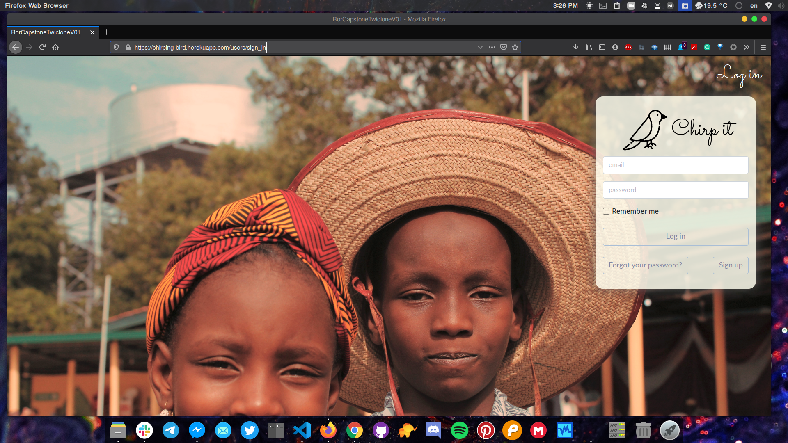
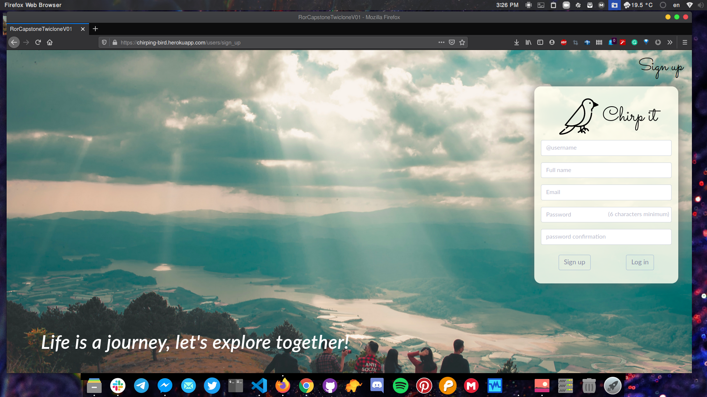
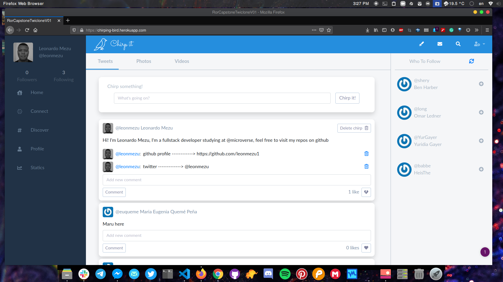
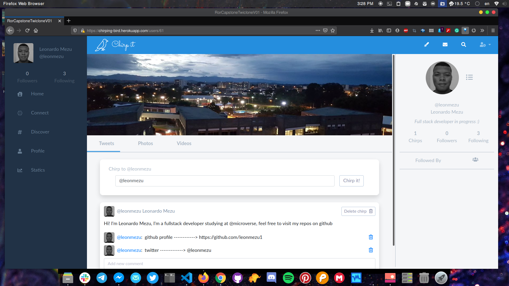

<p align="center">
  
  <br />
  <h3 align="center">Ruby on Rails Capstone Project:</h3>
  <h2 align="center">Chirp it!</h2>
  <p align="center">
  <br />
    <a href="https://github.com/leonmezu1/ror-capstone-twiclone_v01"> Explore the repo</a> - <a href="https://github.com/leonmezu1/Bot-Capstone/issues">Report Bugs »</a>
  <br />
  </p>
</p>

<p align="center"><h3 align="center">New ways of expressing yourself</h3>
<br />
</p>

<p align="center"><h3><strong>Index</strong></h3>
</p>

<!-- INDEX -->

- [About The Project](#about-the-project)
- [Live Link](#live-link)
- [Road map](#road-map)
- [Prerequisites and Instructions](#prerequisites-and-instructions)
- [Run Commands](#run-commands)
- [Built With](#built-with)
- [Contact](#contact)
- [Acknowledgements](#acknowledgements)
<!-- ABOUT THE PROJECT -->

## About The Project

**Chirp it!** is a former social network webapp inspired on [Gregoire Villa's Twitter redesign](https://www.behance.net/gallery/14286087/Twitter-Redesign-of-UI-details). UI/UX for this project has been created in order to keep a slick but capable interaction. 

I hope you enjoy testing and using the application as much as I did developing it, feel free to contact me if you would like to know more about me and this project.

## Live Link

[Chirp it!](https://chirping-bird.herokuapp.com/)

### Project preview







## Road map

**You can give a look to the project's road map documentation here:** [ROAD-MAP](documentation/roadmap.md)

## Prerequisites and Instructions

In order to run the app locally you **will need to fetch this dependencies first**:

> **Ruby -v ```2.7.0```**

> **Rails -v ```6.0.2.2```**

> **npm**

> **yarn**

## Run Commands

Fetch the gem set and npm modules using

> **``` bundle install ```  &  ``` npm install ```**

Start your databases with

> **``` rails db:create rails db:migrate ``` if you need preset data use: ``` rails db:seed ```**

Run the server with:

> **``` rails s ```**

Fire-up your **localhost** and you will be ready to go!

## Built with:

- **Ruby on rails**
- **Bootstrap-4**
- **Font-awesome**
- **Cloudinary** 


<!-- CONTACT -->

## Contact

<p align="center">

Project Link: [https://github.com/leonmezu1/Bot-Capstone](https://github.com/leonmezu1/Bot-Capstone)

<p align="center">

Leonardo Mezu - [Leonardo Mezu L.](https://github.com/leonmezu1)

</p>
<p align="center" style="display: flex; justify-content: center; align-items: center;">
    <a target="_blank" href="https://mail.google.com/mail/?view=cm&fs=1&tf=1&to=leo7xs@gmail.com">
      leo7xs@gmail.com
    </a> &nbsp; |
    <a target="_blank" href="https://github.com/leonmezu1?tab=repositories">
      Portfolio
    </a> &nbsp; |
    <a target="_blank" href="https://www.linkedin.com/in/leonardomezlob/">
      LinkedIn
    </a> &nbsp; |
    <a target="_blank" href="https://twitter.com/https://twitter.com/leonmezu">
      Twitter
    </a>
</p>
<!-- ACKNOWLEDGEMENTS -->

## Acknowledgements

**The pictures used in this project are not of my property, you can now more about them in my pexels collection**

[Pexels Collection](https://www.pexels.com/collections/simple-yet-beautiful-zcprb8n/)

**Cloud storage service is provided by Cloudinary**


